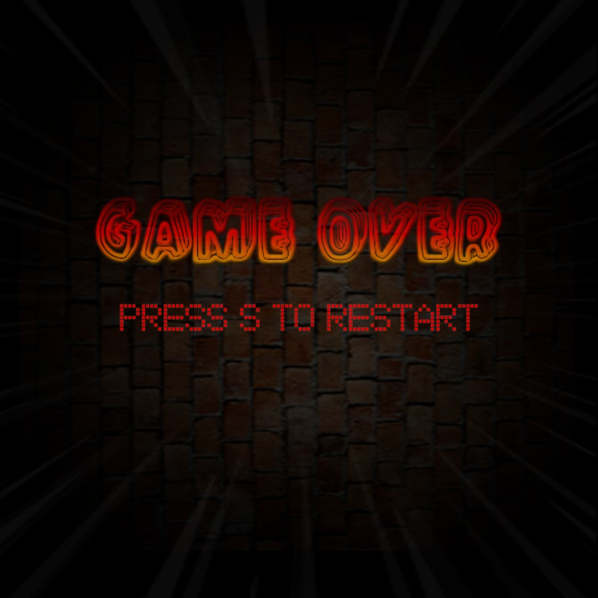
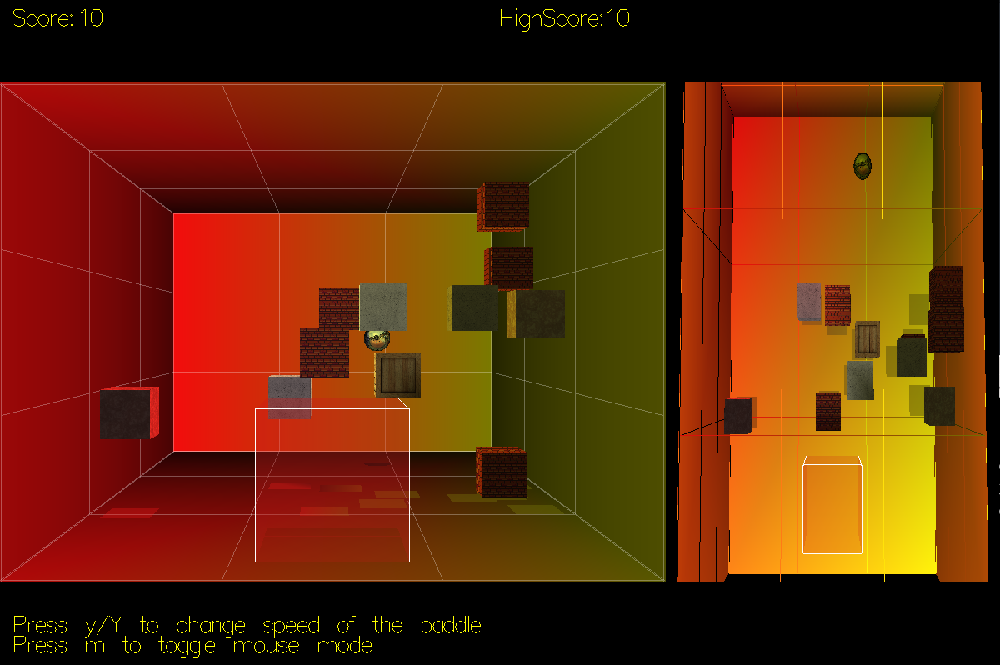
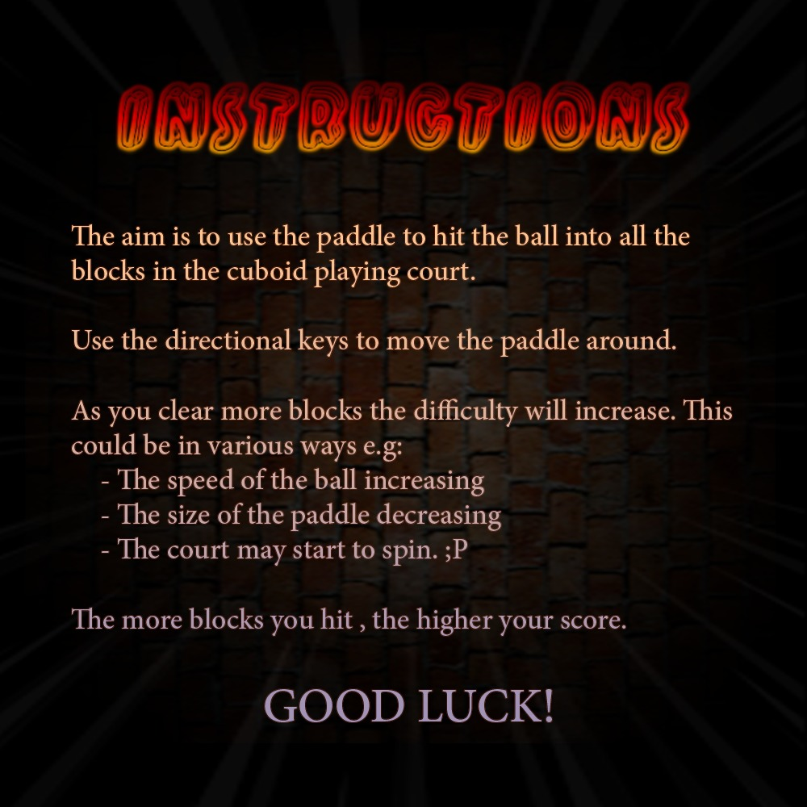
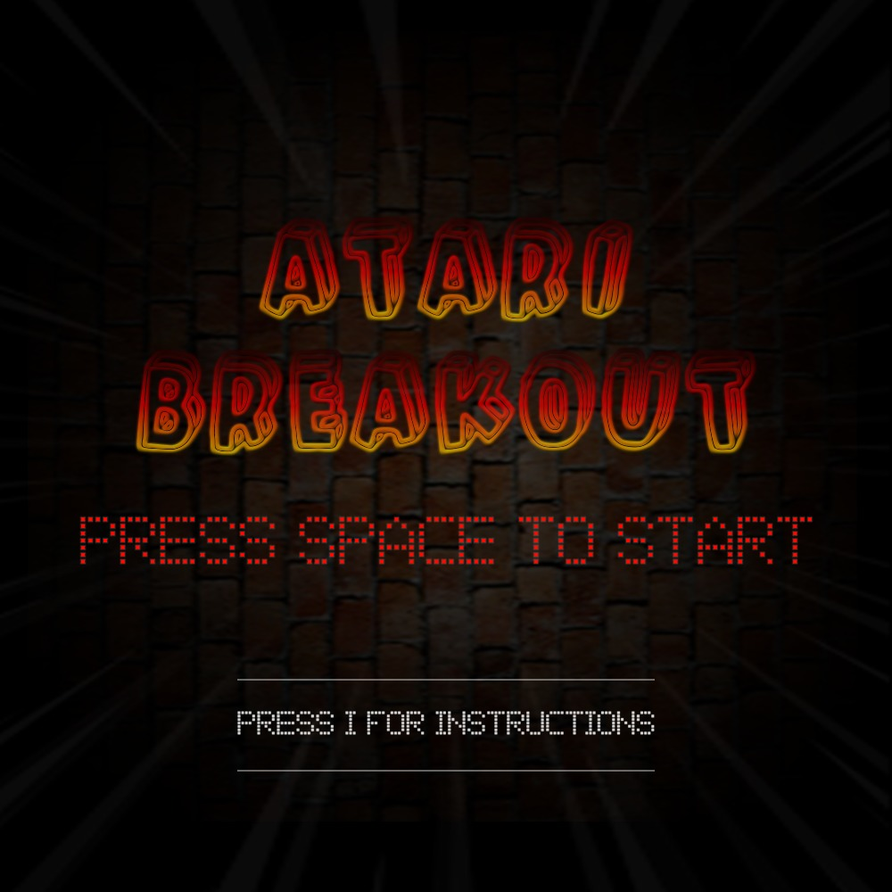
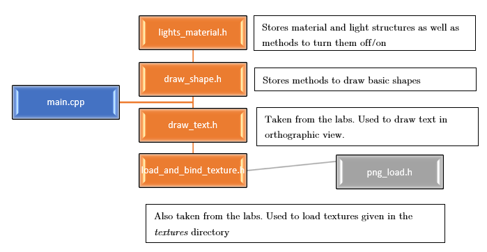
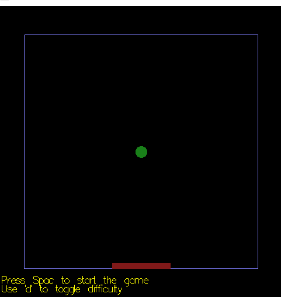
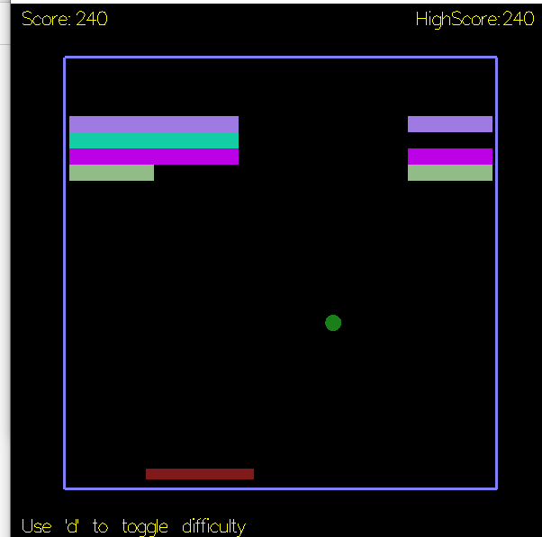

# 3D Maze Game

A simple 3d spaceship navigating a maze

<!-- toc -->

- [3D Maze Game](#3d-maze-game)
  - [Gamplay Images](#gamplay-images)
  - [Design](#design)
    - [Game Play](#game-play)
    - [Structure](#structure)
  - [Open GL/GLSL Features](#open-glglsl-features)
    - [Double Buffering](#double-buffering)
    - [Display Lists](#display-lists)
    - [Hierarchical Model Transformations](#hierarchical-model-transformations)
  - [Compiling](#compiling)
  - [Development Screenshots](#development-screenshots)

<!-- tocstop -->

## Gamplay Images

| | | |
|:-------------------------:|:-------------------------:|:-------------------------:|
|  |  |  |
|  |  | |

## Design

### Game Play

The game designed involves the interaction of 4 main 3D objects; the **court**, the **paddle**, the
**blocks**, and the **ball**. The aim of the game is for the user to clear the court of all blocks by using
the paddle to hit the ball back and forth in the court. The score of the user is increased based
on how many blocks they have cleared from the map. The high score of the user is stored in the
game if it's kept open.

Once the ball goes past the paddle (out of the screen), then the user has lost the game.

The game starts with a menu screen where the user can press either space to advance to
the game or they can press the "I" key to bring up an instruction menu.

Once the user has entered the game the ball is fired off straight away at a random angle
from the paddle. This is done by using `sin()` and `cos()` functions to calculate the x and
y vectors that are needed.

Once the ball is moving the user can use the directional keys (up, down, left, right) to
maneuver the paddle around the screen. If the user prefers, they can use the mouse
instead by pressing the "m" key. This was implemented as it allowed for easier gameplay.

When the directional keys are used the movement of the ball is done using the
`glutidleFunc()` method.

Every time the ball hits a block/paddle it will bounce off by reversing either its x, y, or
z direction.

Once gameplay has started the difficulty is slowly increased using a variety of methods:

1. The speed of the ball is increased
2. The size of the paddle is then slowly decreased
3. The court will start rotating along the z axis making it very hard to control the
paddle.

### Structure

The game was coded using classes to allow for organized, generic, reusable pieces. All classes
included standard functions such as `draw()`, `init()`, `restart()`. This made it a lot easier to
keep track of everything, in addition to making feature addition a lot easier. The classes that
were used are briefly listed below:

- **CLASS Court**: This class contained methods and data related to the 3D court.
Included methods such as retrieving the current court size and getting the court
boundaries.
- **CLASS Ball**: Contains methods and data related to the 3D ball. Included methods to
check if the ball had collided with the paddle and the walls.
- **CLASS Paddle**: Included methods to check if the paddle had touched any boundary.
- **CLASS Grid**: Included methods to; generate Blocks in random positions; keep track of score, and chek if any collisions with the blocks had occurred.


## Open GL/GLSL Features

### Double Buffering

The double buffering technique is used with geometry being drawn onto the back buffer. Since there is a lot of movement going on in the scene, the objects are only put on the front buffer, which shows onto the screen right at the end when the buffers are switched.

### Display Lists

All throughout the code, display lists are used to pre-compile vertices for objects that are repeatedly drawn, such as to precompile drawings of the ball/blocks and paddle.

### Hierarchical Model Transformations

Display lists are used in conjunction with `glTranslatef()` and `glRotatef()` to efficiently draw objects. `glPushMatrix()` and `glPopMatrix()` are used consistently on the `GL_MODELVIEW` stack to create a hierarchy of objects whose positions, orientation, and sizes are relative to each other. An example of this is the blocks which use a textured plane that is translated and rotated 6 times to create the blocks.

## Compiling

This game uses the fixed pipeline instead of any programmable shaders, so it can simply be compiled by opening the terminal in the folder with `main.cpp` and executing the following command:

```bash
Make ~f Makefile. linux main
# Once this is done you can open the game by typing
./main
```

## Development Screenshots

| | |
|:-------------------------:|:-------------------------:|
|  |  |
